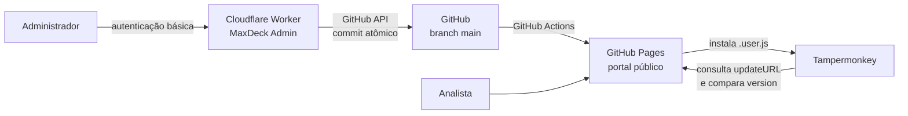

# Arquitetura do MaxDeck

## Visão geral

O MaxDeck combina um portal estático no GitHub Pages com um painel administrativo executado em um Cloudflare Worker. O GitHub é a fonte de verdade para o catálogo, os scripts e as mídias.

## Componentes

### Portal público

Arquivo principal: `site/index.html`

É uma aplicação estática sem etapa de compilação. No carregamento, busca `site/catalog.json` com cache desabilitado, mantém apenas os itens publicados e monta os cards no navegador.

Responsabilidades:

- busca e filtro por categoria;
- destaques e ordem pública;
- instalação dos arquivos `.user.js`;
- compartilhamento por fragmento de URL, por exemplo `#S003`;
- rolagem e destaque do card compartilhado;
- demonstrações em imagem ou GIF;
- orientação de instalação do Tampermonkey;
- idade da última atualização.

### Catálogo

Arquivo: `site/catalog.json`

O catálogo separa metadados de apresentação do conteúdo dos scripts.

| Campo | Função |
| --- | --- |
| `id` | Identidade pública estável usada nos links diretos. |
| `name` | Nome exibido no card e no painel. |
| `version` | Versão publicada e injetada no cabeçalho Tampermonkey. |
| `file` | Nome imutável do `.user.js` depois da criação. |
| `description` | Resumo exibido no card. |
| `category` | `TendiChat`, `MaxAtendimento` ou `Outros`. |
| `enabled` | Define se o card aparece no portal. |
| `featured` | Define se o card pertence aos destaques. |
| `displayOrder` | Ordem dentro da seção de destaque ou regular. |
| `updatedAt` | Data da última publicação do arquivo do script. |
| `media` | Até três demonstrações com caminho, texto alternativo e tipo. |

### Scripts

Diretório: `site/scripts/`

Cada arquivo é servido diretamente pelo GitHub Pages. Durante a criação ou atualização, o Worker valida o cabeçalho e garante:

- `@version` igual à versão do catálogo;
- `@downloadURL` apontando para o arquivo público;
- `@updateURL` apontando para o mesmo arquivo público.

O Tampermonkey consulta periodicamente `@updateURL`, compara `@version` e, quando encontra uma versão maior, baixa o conteúdo indicado por `@downloadURL`.

### Painel administrativo

Arquivo: `admin/worker.js`

O Worker contém a interface administrativa e a API. A autenticação usa HTTP Basic Auth; somente a senha é relevante e sua comparação é feita por hashes de tamanho fixo.

Rotas principais:

| Método e rota | Responsabilidade |
| --- | --- |
| `GET /api/catalog` | Ler e normalizar o catálogo da branch `main`. |
| `PUT /api/catalog` | Publicar metadados, visibilidade, destaque, ordem e mídias. |
| `GET /api/script?file=...` | Carregar o conteúdo de um script para edição. |
| `POST /api/script` | Criar script, ID, mídias e catálogo. |
| `PUT /api/script` | Atualizar script existente, mídias, catálogo e data. |

Limites aplicados pelo Worker:

- script: 2 MB;
- mídia: 3 MB por arquivo;
- mídias: três por script;
- requisição total: 16 MB;
- catálogo: até 250 itens.

## Fluxo de publicação administrativa

1. O painel lê a referência atual de `main` e o `catalog.json`.
2. Os dados recebidos são higienizados e validados.
3. Novas mídias recebem caminhos seguros em `site/media/`.
4. O cabeçalho Tampermonkey é validado e atualizado.
5. O Worker cria blobs para todos os arquivos alterados.
6. Uma nova árvore Git reúne script, catálogo, mídias e exclusões.
7. Um único commit é criado.
8. A referência `main` é avançada sem `force`.
9. Se outro processo avançou `main`, a operação falha em vez de sobrescrever trabalho concorrente.
10. O GitHub Actions publica novamente a pasta `site`.

Esse desenho garante que o portal não aponte para um script ou mídia que ainda não exista no mesmo commit.

## Atualização no Tampermonkey

Uma atualização automática depende de três condições:

1. o arquivo continua disponível na mesma URL;
2. o cabeçalho contém `@updateURL` e `@downloadURL` válidos;
3. `@version` é maior que a versão instalada.

Alterar somente o catálogo não atualiza o script instalado. Desmarcar `enabled` também não desativa o script nas máquinas dos analistas; apenas esconde seu card.

Renomear um arquivo existente quebra a URL conhecida pelas instalações anteriores. Por isso, o painel bloqueia a troca de nome do arquivo durante a edição.

## Publicação do portal

O workflow `.github/workflows/deploy-pages.yml` é executado em pushes para `main` e também pode ser disparado manualmente. Ele envia exclusivamente a pasta `site` para o GitHub Pages.

Consequências:

- mudanças em `site/` entram no portal após o workflow concluir;
- mudanças em `admin/worker.js` não são publicadas na Cloudflare pelo workflow;
- o painel precisa ser publicado separadamente com Wrangler;
- um navegador que já estava aberto pode precisar de recarga forçada para receber um novo `index.html`.

## Segurança e segredos

O Worker depende de dois segredos armazenados na Cloudflare:

- `ADMIN_PASSWORD`: senha de acesso ao painel;
- `GITHUB_TOKEN`: autorização para leitura e escrita no repositório.

Os valores não pertencem ao Git e nunca devem aparecer em arquivos, comandos registrados, mensagens ou logs. A publicação com Wrangler deve preservar as variáveis e ser seguida por uma conferência da lista de nomes dos segredos.

O portal e o repositório são públicos. Portanto, nenhum conteúdo dentro de `site/`, histórico Git ou código dos scripts deve ser tratado como confidencial.

## Concorrência entre painel e desenvolvimento local

Há dois escritores possíveis para `main`:

- o painel administrativo;
- um desenvolvedor ou agente trabalhando por Git.

Antes e depois de uma alteração local, consulte `origin/main`. Nunca force um push. Se o painel publicou durante o trabalho, incorpore os novos commits, verifique o diff e só então publique.

## Recuperação e diagnóstico

- Portal antigo após publicação: confira o GitHub Actions e faça uma recarga forçada.
- Catálogo novo, portal antigo: aguarde o deploy do Pages e evite confiar em cache do HTML.
- Painel recebe erro do GitHub: confira validade e permissões do `GITHUB_TOKEN`.
- Admin responde 401 sem credenciais: comportamento esperado.
- Script não atualiza: confirme URL, versão maior e permissões do Tampermonkey.
- Conflito ao publicar: recarregue o painel para obter o catálogo mais recente antes de repetir.

## Continuidade do projeto

Em uma máquina nova, clone o repositório e use a branch `main` atual como fonte de verdade. Leia `README.md`, `AGENTS.md` e este documento antes de alterar código. Autenticações do GitHub e da Cloudflare são locais à máquina; os segredos de produção continuam armazenados nos serviços remotos.

